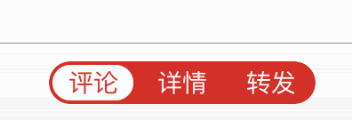

# DynamicMaskSegmentSwitch
A segment switcher with dynamic text mask effect

##Preview:


Indicator will bounce when progress less than 0 or larger than 1.




##Simple Usage:

You can create DynamicMaskSegmentSwitch by xib or programmatically.Then just fill the property named `configure`.

```swift
    let configure = DynamicMaskSegmentSwitchConfigure(highlightedColor: .orangeColor(), normalColor: .whiteColor(), items: ["首页","消息","发现","个人"])
    switcher.configure = configure
```

And you must set the delegate `DynamicMaskSegmentSwitchDelegate` and use this method

```swift
	switcher.delegate = self
    func switcher(switcher: DynamicMaskSegmentSwitch, didSelectAtIndex index: Int) {
        
    }
```

That's all!

You can tap the specific item,the indicator will move to target item.

You can also change the property named `progress`,the indicator will also move with progress.


